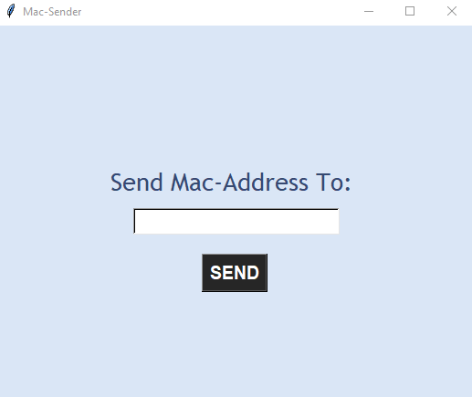

# Mac-Address-Sender

### Description
This is a simple python program, aiding in Fetching the Mac Address of a pc where the Mac-sender.py is being operated, after acquiring the Mac Address, the program asks the user to enter an email (Gmail only) to send the Mac Address to it.

### MORE INFO

GUI is made with Tkinter.\
The user is asked to enter a valid to send to the provided email within the shown entry in the GUI, Thereafter
the Mac-Address is fetched via importing getnode() from UUID lib and sent to the provided email via smtplib which is a built-in lib in python.

All included libraries\
smtplib, Tkinter, UUID
